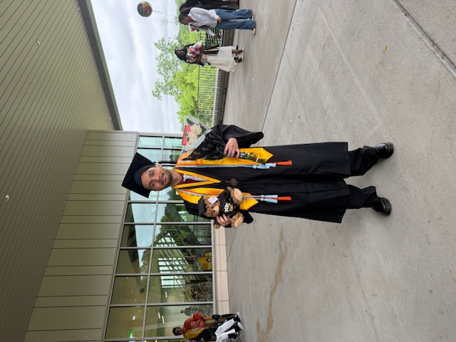

---
# Feel free to add content and custom Front Matter to this file.
# To modify the layout, see https://jekyllrb.com/docs/themes/#overriding-theme-defaults

layout: page
title: Home
---

    

    Hello world! My name is Rusham Raj Bhatt, and I am an incoming PhD student at the University of illinois Chicago, and I am very enthusiastic about robotics! During my undergraduate studies, I had the privilege of conducting research at the Protein Data Bank at Rutgers University-New Brunswick, Harvard Medical School, and Salk institute for Biological Studies, and at my beloved alma mater UMBC. My research spanned scientific software development, bioinformatics, and machine learning. During my free time, I enjoying playing video games and sports, such as pickleball and soccer, especially soccer I am such a die-hard fan :)
    

    

        

            
        

    

